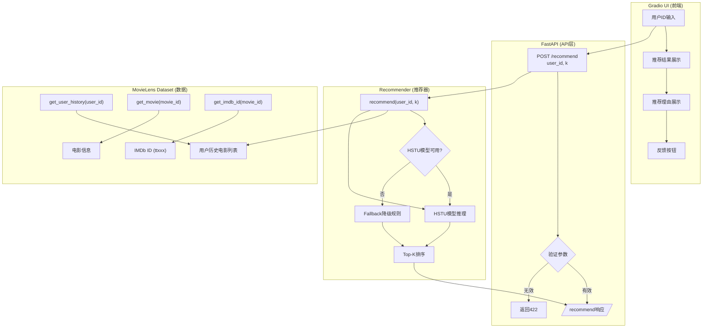
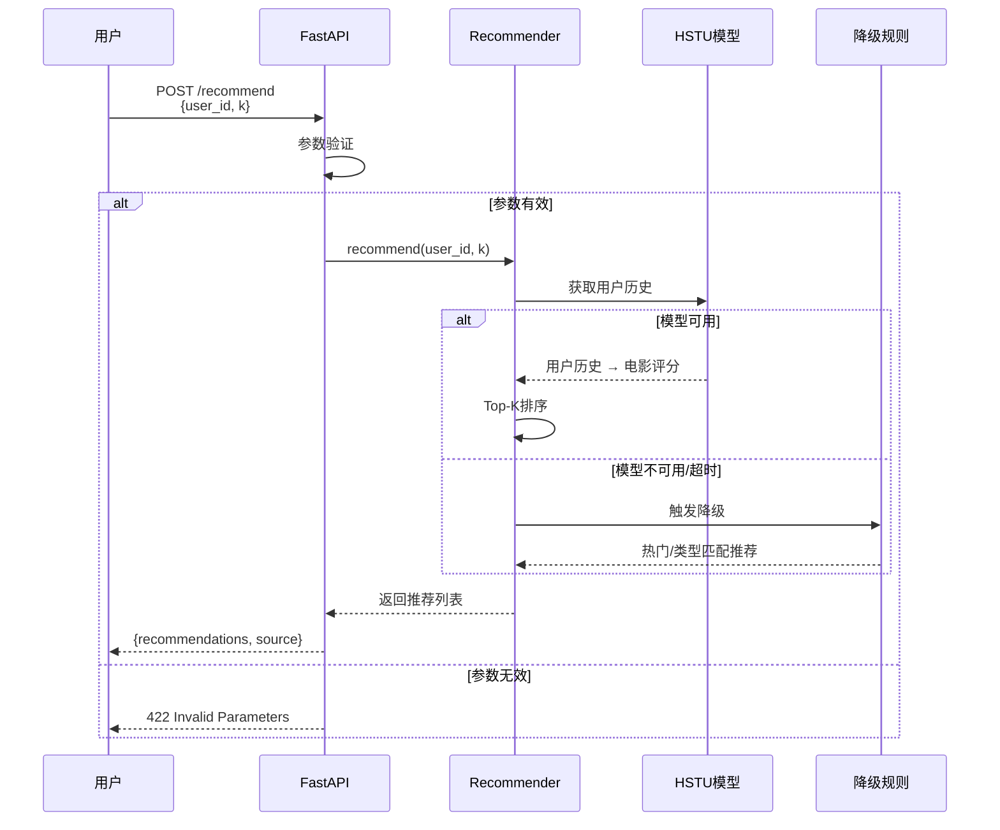
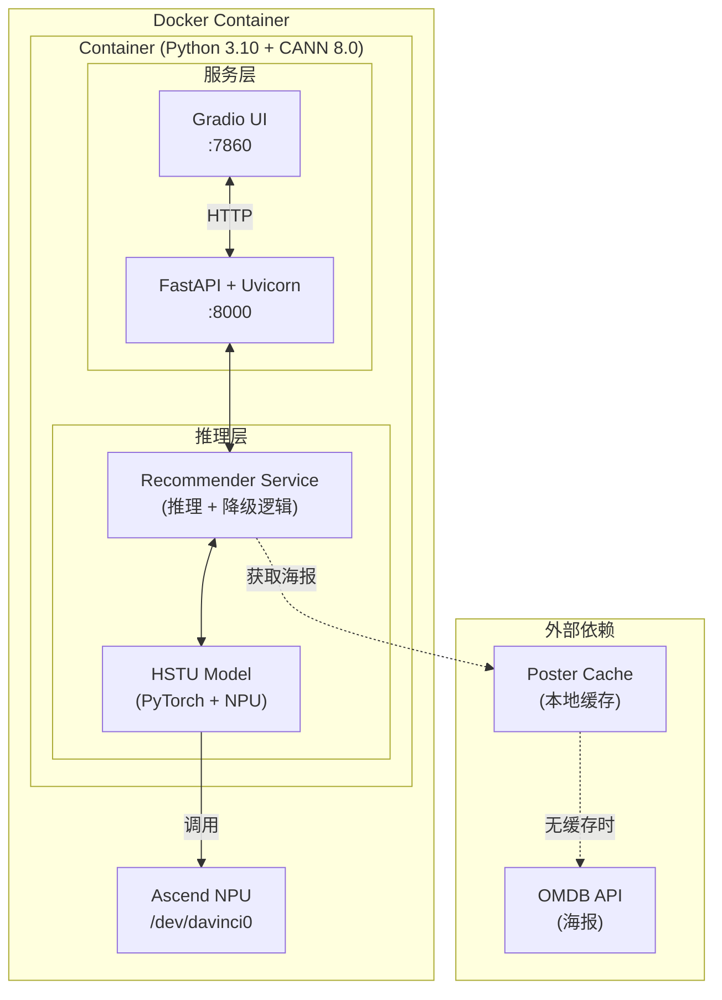
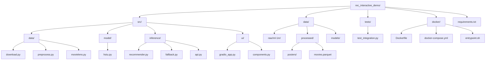
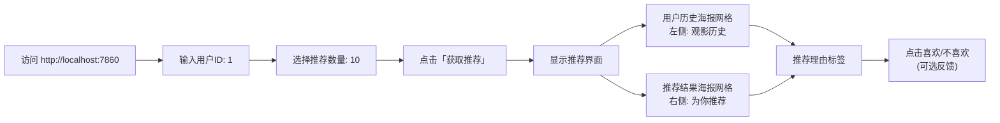

# 昇腾推荐系统可视化演示

## Summary

在昇腾NPU平台上实现一个端到端的推荐系统可视化演示系统。使用MovieLens数据集、简化版HSTU推荐算法（序列模型）、Ascend RecSDK训练框架、原生PyTorch推理引擎，通过Gradio前端和Docker容器化部署，实现用户交互式电影推荐演示。目标在2周内完成从数据处理到可视化展示的完整流程。

---

## Problem Frame

用户需要一个能够展示昇腾平台推荐系统能力的可视化演示系统。该系统需要：
- 快速搭建并在演示当天稳定运行
- 体现昇腾NPU的推理加速能力（通过Docker容器化部署）
- 让观众直观感受推荐效果
- 支持用户交互式体验推荐效果

**约束条件**:
- 时间紧（2周内完成）
- 演示优先于算法精度
- 简单快速的实现方案
- 需要有降级策略保证演示稳定性

**注**: 本演示聚焦于端到端推荐流程的完整展示，包括数据处理→模型推理→API服务→前端交互。嵌入空间可视化(UMAP/t-SNE)和NPU性能对比作为后续迭代目标，不在本计划范围内。

---

## Requirements

- R1. 支持用户输入用户ID并获取推荐结果
- R2. 推荐结果包含电影名称、评分、推荐理由
- R3. 推荐系统能够在昇腾NPU上完成模型推理
- R4. 提供Docker一键部署能力
- R5. 当模型推理不可用时，自动降级到基于规则的推荐（结合用户历史）
- R6. 整个流程在2周内可完成端到端实现
- R7. 前端展示电影海报和用户观影历史

**Origin actors:** 数据科学家（演示观众）、开发工程师（系统维护者）
**Origin flows:** 数据加载 → 模型训练 → 推理服务 → API调用 → 前端展示
**Origin acceptance examples:** 用户输入用户ID后3秒内返回推荐结果；Docker环境下一键启动所有服务

---

## Scope Boundaries

- 不追求推荐算法的最高精度，以演示功能完整性为主
- 暂不实现真实的在线学习能力，反馈数据仅用于展示
- 暂不实现多模型对比和A/B测试功能
- 不包含用户管理系统，演示环境为单用户模式
- 嵌入空间可视化（UMAP/t-SNE）不在本计划范围
- CPU vs NPU性能对比不在本计划范围

### Deferred to Follow-Up Work

- 嵌入空间可视化（UMAP/t-SNE）：后续迭代中加入2D/3D可视化
- NPU量化对比：后续版本加入CPU vs NPU性能对比展示

---

## 4+1 Architectural Views

### 1. Logical View（逻辑视图）

**功能结构**:



**核心模块职责**:
- **Gradio UI**: 用户交互界面，接收user_id，展示推荐结果、海报和用户历史
- **Gradio Components**: 可视化组件封装（海报网格、推荐卡片）
- **FastAPI**: RESTful API服务，请求路由和数据验证
- **Recommender**: 核心推荐逻辑，协调模型推理和降级
- **HSTU Model**: 序列推荐模型，输入用户历史，输出电影评分
- **Fallback Rules**: 规则降级，基于用户历史类型匹配热门电影
- **MovieLens Dataset**: 数据访问接口，提供用户历史、电影信息和IMDb ID映射
- **Poster Cache**: 海报缓存管理，从OMDB API获取并缓存海报
  - 映射流程: movie_id → imdb_id → `tt{imdb_id}` → OMDB API

---

### 2. Process View（过程视图）

**并发与同步**:



**关键处理点**:
- **同步请求**: FastAPI使用async/await，每个请求独立处理
- **模型推理**: 单例模式，模型预加载到内存，避免重复加载
- **降级触发**: 推理超时(>2s)或异常时自动降级
- **结果缓存**: 可选，对热门用户结果缓存(30分钟TTL)

---

### 3. Physical View（物理视图）

**部署架构**:



**环境变量**:
- `ASCEND_VISIBLE_DEVICES=0` — 指定使用的NPU设备
- `CANN_VERSION=8.0` — CANN版本
- `MODEL_PATH=/app/data/models/model.pt` — 模型路径

---

### 4. Development View（开发视图）

**代码组织**:



**依赖关系**:
```
requirements.txt
├── torch (PyTorch核心)
├── fastapi + uvicorn (API服务)
├── gradio (前端UI)
├── pandas + numpy + pyarrow (数据处理)
└── pytest (测试)
```

**构建流程**:
1. `pip install -r requirements.txt` — 安装Python依赖
2. `python src/data/download.py` — 下载MovieLens数据
3. `python src/training/train.py` — 训练模型
4. `docker-compose up` — 启动服务

---

### +1. Scenarios（场景视图）

**关键场景**:

| 场景 | 描述 | 路径 | 预期结果 |
|------|------|------|----------|
| S1 | 有历史用户获取推荐 | user_id=1 → /recommend → 模型推理 → Top-10 | 返回10条推荐含理由 |
| S2 | 冷启动用户获取推荐 | user_id=99999 → /recommend → 降级规则 | 返回热门均衡推荐 |
| S3 | 模型推理失败降级 | 模拟推理异常 → 降级触发 | 返回规则推荐+source=fallback |
| S4 | Docker环境启动 | docker-compose up → health check | 所有服务就绪 |
| S5 | Gradio交互 | 输入user_id=1, k=5 → 展示结果 | 5秒内显示推荐 |

**用户交互流**:



---

## Context & Research

### Relevant Code and Patterns

- **recsys-examples (NVIDIA)**: HSTU算法和DynamicEmb实现的参考
- **Ascend RecSDK**: 昇腾推荐系统SDK，提供训练和推理的基础API
- **fbgemm-ascend**: FBGEMM量化库昇腾适配，支持INT8/FP8推理
- **HierarchicalKV-ascend**: 分层KV缓存优化（可选集成）
- **PTA仓库** (`/Users/huangshilei/Documents/pythonprojects/pta/`): PyTorch Ascend适配器

### External References

- MovieLens数据集: https://grouplens.org/datasets/movielens/
- Gradio文档: https://gradio.app/docs/
- FastAPI文档: https://fastapi.tiangolo.com/
- Ascend CANN: Compute Architecture for Neural Networks

---

## Key Technical Decisions

- **数据集**: MovieLens 1M - 公开可用，有丰富的预处理参考代码
- **推荐算法**: 简化版HSTU（序列模型）— 输入用户历史序列，输出电影评分
- **训练方式**: 单节点训练，使用Ascend CANN + torch-npu，不使用分布式
- **推理引擎**: 原生PyTorch + Ascend NPU后端（torch.npu）
- **API服务**: FastAPI（轻量、Python原生、自动文档）
- **前端**: Gradio（推荐系统专用组件、快速原型，含电影海报和用户历史可视化）
- **部署**: Docker + docker-compose（开箱即用）
- **降级策略**: 基于用户历史的分层降级
  - 有历史用户 → 基于类型匹配的热门推荐
  - 冷启动用户 → 热门且类型均衡的推荐

---

## Open Questions

### Resolved During Planning

- **Q: API输入是什么？** A: `user_id` + `k`（推荐数量），系统从全量电影中返回Top-K推荐
- **Q: 推荐理由如何生成？** A: 规则生成（基于用户历史类型、热门类别等），非模型生成
- **Q: 降级规则如何处理用户历史？** A: 分层策略 — 有历史用类型匹配，冷启动用均衡热门
- **Q: 单元如何组织？** A: 合并为5个单元，减少串行依赖

### Deferred to Implementation

- 模型训练的超参数（需根据硬件调整）
- 推荐结果数量K的默认值（需根据UI测试确定）
- 嵌入维度（需权衡模型大小和推理速度）
- OMDB API key配置（需申请免费的API key: https://www.omdbapi.com/apikey.aspx）

---

## Output Structure

```
rec_interactive_demo/
├── data/                      # 数据目录
│   ├── raw/                   # 原始数据
│   │   └── ml-1m/
│   ├── processed/              # 处理后数据
│   │   ├── movies.parquet    # 电影元数据
│   │   └── posters/          # 电影海报缓存
│   └── models/                # 保存的模型
│       └── model.pt
├── src/                       # 源代码
│   ├── __init__.py
│   ├── data/                  # 数据处理
│   │   ├── __init__.py
│   │   ├── download.py        # 数据下载
│   │   ├── preprocess.py      # 数据预处理
│   │   └── movielens.py       # MovieLens Dataset类
│   ├── model/                 # 模型定义
│   │   ├── __init__.py
│   │   └── hstu.py           # 简化版HSTU序列模型
│   ├── training/              # 训练脚本
│   │   ├── __init__.py
│   │   └── train.py           # 训练入口
│   ├── inference/             # 推理服务 (U3)
│   │   ├── __init__.py
│   │   ├── recommender.py     # 推荐器类
│   │   ├── fallback.py         # 降级规则
│   │   └── api.py              # FastAPI服务
│   ├── ui/                    # 前端UI (U4)
│   │   ├── __init__.py
│   │   ├── gradio_app.py     # Gradio应用
│   │   └── components.py     # 可视化组件
├── docker/                    # Docker配置 (U5)
│   ├── Dockerfile
│   ├── docker-compose.yml
│   └── entrypoint.sh
├── tests/                     # 测试
│   ├── __init__.py
│   └── test_integration.py    # 集成测试
├── requirements.txt
├── README.md
└── .gitignore
```

---

## High-Level Technical Design

> *This illustrates the intended approach and is directional guidance for review, not implementation specification.*

```
┌─────────────────────────────────────────────────────────────────┐
│                        Docker Container                          │
│  ┌─────────────┐    ┌─────────────────────────────────────┐    │
│  │  Gradio UI  │───▶│  FastAPI + PyTorch Inference        │    │
│  │  (Port 7860)│    │  (Port 8000) + Ascend NPU          │    │
│  └─────────────┘    └─────────────────────────────────────┘    │
│                                    │                            │
│                                    ▼                            │
│                           ┌─────────────────┐                   │
│                           │  Fallback Rules │                   │
│                           │ (基于用户历史)   │                   │
│                           └─────────────────┘                   │
└─────────────────────────────────────────────────────────────────┘
```

**数据流**:
1. 用户在Gradio界面输入user_id
2. 请求发送到FastAPI `/recommend` 端点
3. FastAPI调用推荐器，传入user_id和k
4. 推荐器检查模型是否可用
   - 模型可用 → 使用HSTU模型推理
   - 模型不可用 → 触发降级规则
5. 返回推荐结果（包含推荐理由）给Gradio展示

**推荐理由生成** (规则驱动):
- `"因为你看过《类型A》类型的电影"` — 基于用户历史最喜爱类型
- `"热门《类型B》电影"` — 基于当前热门类别
- `"热门推荐（新用户）"` — 冷启动用户

**模型训练流程** (提前完成，演示时只加载):
1. 下载MovieLens 1M数据
2. 预处理：用户-电影交互、电影类型映射
3. 定义简化版HSTU序列模型
4. 使用Ascend NPU训练（限制epoch+早停）
5. 保存模型到 `data/models/`

---

## Implementation Units

- U1. **项目结构与数据处理**

**Goal:** 创建项目目录结构、配置文件，实现数据下载和预处理

**Requirements:** R1 (部分), R6

**Dependencies:** None

**Files:**
- Create: `requirements.txt`
- Create: `.gitignore`
- Create: `src/__init__.py`
- Create: `src/data/__init__.py`
- Create: `src/data/download.py`
- Create: `src/data/preprocess.py`
- Create: `src/data/movielens.py`
- Create: `data/raw/.gitkeep`
- Create: `data/models/.gitkeep`

**Approach:**
- 使用标准Python项目结构
- requirements.txt: torch, fastapi, gradio, uvicorn, pandas, numpy, scikit-learn, pyarrow, requests
- 数据处理: 下载MovieLens 1M → 解析 → 转换为模型可用格式
- **ID映射**: MovieLens movieId → links.csv → imdbId → `tt{imdbId}` → OMDB API
- MovieLens Dataset类:
  - `get_user_history(user_id)`: 返回用户历史电影列表
  - `get_movie(movie_id)`: 返回电影信息(含imdb_id)
  - `get_imdb_id(movie_id)`: 返回格式化的IMDb ID (`tt{imdbId}`)

**Patterns to follow:**
- torch.utils.data.Dataset接口
- 数据目录和代码目录分离

**Test scenarios:**
- Happy path: 成功下载并解析MovieLens数据，`get_user_history`返回正确历史
- Edge case: 用户无历史时返回空列表
- Edge case: 电影ID不存在时返回None
- Edge case: links.csv缺少imdbId时的处理

**Verification:**
- `python -c "from src.data.movielens import MovieLensDataset; ds = MovieLensDataset('./data'); print(ds.get_user_history(1))"` 返回用户1的历史
- `python -c "from src.data.movielens import MovieLensDataset; ds = MovieLensDataset('./data'); print(ds.get_imdb_id(1))"` 返回 `tt0114709`

---

- U2. **模型定义与训练**

**Goal:** 定义简化版HSTU序列模型，实现模型训练

**Requirements:** R3, R6

**Dependencies:** U1

**Files:**
- Create: `src/model/__init__.py`
- Create: `src/model/hstu.py`
- Create: `src/training/__init__.py`
- Create: `src/training/train.py`
- Create: `data/models/model.pt` (运行时生成)

**Approach:**
- HSTU序列模型:
  - 输入: 用户历史电影ID序列 (batch, seq_len)
  - 输出: 所有电影的评分 (batch, num_movies)
  - 结构: 嵌入层 → Transformer编码器层 → 评分层
- 训练器: Adam优化器 + MSE损失（或BPR排序损失）+ 早停
- 使用Ascend NPU: `torch.npu.set_device()` + `torch.npu.amp`（如支持）

**Patterns to follow:**
- torch.nn.Module接口
- recsys-examples中的HSTU架构参考

**Test scenarios:**
- Happy path: 模型前向传播，输出形状正确 `(batch, num_movies)`
- Edge case: 用户历史全0（空序列）时的处理
- Error path: 嵌入维度不匹配时的异常

**Verification:**
```python
import torch
from src.model.hstu import SimpleHSTU
model = SimpleHSTU(num_users=6040, num_movies=3706, embed_dim=64)
user_seq = torch.tensor([[1, 2, 3, 0, 0]], dtype=torch.long)  # 用户历史序列
model.eval()
with torch.no_grad():
    scores = model(user_seq)  # 输出: (1, 3706)
    print(f"scores shape: {scores.shape}")  # 应为 (1, 3706)
```

---

- U3. **推理服务与API**

**Goal:** 实现推荐器类和FastAPI服务

**Requirements:** R2, R3, R5

**Dependencies:** U2

**Files:**
- Create: `src/inference/__init__.py`
- Create: `src/inference/recommender.py`
- Create: `src/inference/fallback.py`
- Create: `src/inference/api.py`
- Modify: `src/inference/__init__.py` 导出推荐器

**Approach:**
- **recommender.py**: 推荐器类
  - `__init__(model_path, movie_db)`: 加载模型和电影数据库
  - `recommend(user_id, k) -> List[Recommendation]`: 核心推荐方法
    - 获取用户历史 → 模型推理 → Top-K → 包装结果
    - 返回包含movie_id, score, title, reason的列表
  - 支持昇腾NPU后端
- **fallback.py**: 降级规则
  - `get_fallback_recommendations(user_id, movie_db, k) -> List[Recommendation]`
  - 有历史用户: 基于类型匹配返回热门
  - 冷启动用户: 返回热门且类型均衡
  - 推荐理由: 规则生成
- **api.py**: FastAPI服务
  - `GET /health`: 健康检查
  - `POST /recommend`: 推荐接口
    - 输入: `{"user_id": int, "k": int}`
    - 输出: `{"recommendations": [{"movie_id": int, "score": float, "title": str, "poster_url": str, "reason": str}], "source": "model|fallback", "user_history": [{"movie_id": int, "title": str, "poster_url": str, "rating": float}]}`
  - `GET /poster/{movie_id}`: 海报获取
    - 流程: movie_id → 获取imdb_id → 转换为tt格式 → 查询本地缓存 → 无则调用OMDB API → 缓存返回
  - 海报URL生成: `POST /recommend`返回的poster_url为 `/poster/{movie_id}`，前端通过此路径获取实际图片

**Patterns to follow:**
- FastAPI最佳实践 + Pydantic数据验证
- 降级策略模式

**Test scenarios:**
- Happy path: 推荐器正常返回结果
- Edge case: 用户无历史时返回降级推荐
- Edge case: 模型加载失败时自动降级
- Error path: API输入参数无效时返回422

**Verification:**
```bash
curl http://localhost:8000/health  # 返回 {"status": "ok"}
curl -X POST http://localhost:8000/recommend \
  -H "Content-Type: application/json" \
  -d '{"user_id": 1, "k": 5}'
# 返回包含5条推荐的结果，每条包含movie_id, score, title, reason
```

---

- U4. **Gradio前端界面（含可视化）**

**Goal:** 实现交互式Web界面，展示带电影海报和用户历史的推荐效果

**Requirements:** R1, R2

**Dependencies:** U3

**Files:**
- Create: `src/ui/__init__.py`
- Create: `src/ui/gradio_app.py`
- Create: `src/ui/components.py` — 可视化组件封装
- Create: `data/processed/posters/` — 电影海报缓存目录

**Approach:**
- **电影海报获取**:
  - 使用OMDB API获取电影海报（免费API，需API key）
  - 海报缓存到本地 `data/processed/posters/{movie_id}.jpg`
  - 降级策略: 如果API无海报，返回默认占位图
- **用户历史展示**:
  - 在推荐结果左侧展示用户看过的电影（海报网格）
  - 每行4-5张海报，显示用户偏好
- **Gradio布局**:
  ```
  ┌─────────────────────────────────────────────────────────────────┐
  │  用户ID: [___]  推荐数量: [===]  [获取推荐]                      │
  ├─────────────────────────────────────────────────────────────────┤
  │  你的观影历史:                    为你推荐:                      │
  │  ┌────┐ ┌────┐ ┌────┐ ┌────┐   ┌────┐ ┌────┐ ┌────┐ ┌────┐  │
  │  │海报│ │海报│ │海报│ │海报│   │海报│ │海报│ │海报│ │海报│  │
  │  └────┘ └────┘ └────┘ └────┘   └────┘ └────┘ └────┘ └────┘  │
  │  《电影1》评分5 《电影2》评分4   推荐理由: 因为你喜欢科幻类      │
  └─────────────────────────────────────────────────────────────────┘
  ```
- **组件**:
  - 用户ID输入框 (Number)
  - 推荐数量滑块 (Slider)
  - 用户历史海报网格 (Gallery)
  - 推荐结果海报网格 (Gallery) + 推荐理由文本
  - 反馈按钮 (喜欢/不喜欢 — 仅展示用)

**Patterns to follow:**
- Gradio Blocks API + Gallery组件
- OMDB API集成（带缓存）

**Test scenarios:**
- Happy path: 海报正常显示，用户历史正常加载
- Edge case: 海报加载失败时显示默认占位图
- Edge case: 用户无历史时显示"暂无观影记录"
- Edge case: API连接失败时显示错误提示

**Verification:**
- Gradio应用在 http://localhost:7860 正常访问
- 输入user_id=1, k=5后显示用户历史海报 + 5条推荐海报及理由

---

- U5. **Docker容器化部署与集成测试**

**Goal:** 实现一键部署，支持Docker环境下的完整演示

**Requirements:** R4, R6

**Dependencies:** U4

**Files:**
- Create: `docker/Dockerfile`
- Create: `docker/docker-compose.yml`
- Create: `docker/entrypoint.sh`
- Create: `tests/__init__.py`
- Create: `tests/test_integration.py`
- Modify: `requirements.txt`

**Approach:**
- **Dockerfile**: 基于Python 3.10镜像
  - 安装系统依赖 (curl, git等)
  - 复制代码和数据
  - 安装Python依赖
  - 设置Ascend CANN环境变量
  - 暴露端口: 7860 (Gradio), 8000 (API)
- **docker-compose.yml**:
  - 单服务: 包含API+Gradio（简化）或分离服务
  - 设备挂载: `/dev/davinci0:/dev/davinci0`
  - 环境变量: `ASCEND_VISIBLE_DEVICES=0`
  - 端口映射: `7860:7860`, `8000:8000`
- **entrypoint.sh**:
  - 检查Ascend驱动
  - 启动API服务
  - 启动Gradio服务
- **集成测试**: pytest测试端到端流程

**Patterns to follow:**
- Docker最佳实践
- docker-compose多服务编排

**Test scenarios:**
- Happy path: `docker-compose up -d` 成功启动
- Edge case: Ascend驱动不可用时的处理
- Edge case: 端口冲突时的错误提示

**Verification:**
```bash
docker-compose up -d
curl http://localhost:8000/health  # {"status": "ok"}
# 访问 http://localhost:7860 查看Gradio界面
```

---

## System-Wide Impact

- **Interaction graph**:
  - Gradio UI → FastAPI `/recommend` → Recommender → HSTU Model OR Fallback
  - Recommender → MovieLens Dataset (get_user_history, get_movie)
- **Error propagation**:
  - 推理错误 → 自动降级到规则推荐
  - API超时 → FastAPI返回降级结果
- **State lifecycle risks**:
  - 模型只需加载一次，保持在内存中
  - 无持久化状态，演示环境无状态

---

## Risks & Dependencies

| Risk | Mitigation |
|------|------------|
| Ascend NPU驱动安装复杂性 | 预先在Docker镜像中集成Ascend CANN环境 |
| 模型训练时间不可控 | 限制训练epoch数量，设置早停（max 5 epochs） |
| 推理延迟影响用户体验 | 降级规则保证响应时间 |
| MovieLens数据下载失败 | 提供本地数据缓存 |
| Docker环境与本地环境差异 | 提供本地开发模式 |

**关键依赖**:
- Ascend CANN驱动 (需与Docker镜像版本匹配)
- torch-npu包 (需与CANN版本匹配)
- 参考PTA仓库: `/Users/huangshilei/Documents/pythonprojects/pta/`

---

## Documentation / Operational Notes

- **README.md**: 项目说明、快速启动指南、Docker部署说明
- **环境要求**: Ascend CANN 8.0+、Python 3.10+、Docker 20.10+
- **启动顺序**: Docker启动 → API就绪 → Gradio就绪
- **监控指标**: API响应时间、推荐结果数量、降级触发率

---

## Sources & References

- **Origin document:** [docs/ideation/2026-05-12-ascend-recsys-visualization.md](../ideation/2026-05-12-ascend-recsys-visualization.md)
- MovieLens数据集: https://grouplens.org/datasets/movielens/
- NVIDIA recsys-examples: https://github.com/NVIDIA/recsys-examples
- Ascend RecSDK: https://gitcode.com/Ascend/RecSDK
- PTA (PyTorch Ascend): `/Users/huangshilei/Documents/pythonprojects/pta/`
- Gradio: https://gradio.app/
- FastAPI: https://fastapi.tiangolo.com/
